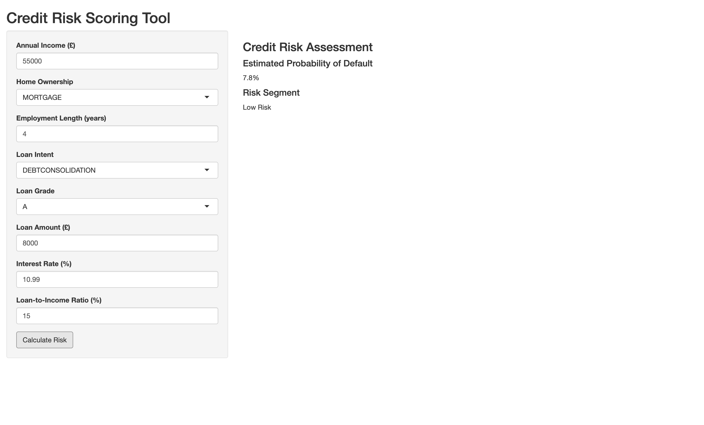

# Credit Risk Analytics & Default Prediction

## Project Overview

This independent project explores credit risk and loan default using a dataset of over 32,000 loan applications. The aim was to identify borrower and loan characteristics associated with default and develop a model to estimate the probability of loan default.

The project combines SQL for data cleaning and exploratory analysis with R for statistical modelling and evaluation. A logistic regression model was developed using borrower and loan characteristics, and the final reduced model achieved a test-set ROC-AUC of 0.8613 on held-out observations.

An interactive R Shiny tool was also developed to allow users to enter borrower and loan characteristics and receive an estimated probability of default and a corresponding risk segment.

#### Tools

- SQL
- R
- R Shiny
- SQLite
- Logistic Regression

## Dataset

The project uses the **Credit Risk Dataset** from Kaggle, containing 32,581 loan applications and 12 borrower and loan-related variables.

The target variable is 'loan_status', where:

- 0 = No default
- 1 = Default

The dataset includes variables relating to:

- Borrower demographics and income
- Home ownership
- Employment length
- Loan intent
- Loan grade
- Loan amount
- Interest rate
- Loan-to-income ratio
- Previous credit default history
- Credit history length

After data quality checks and removal of a small number of implausible observations, 32,574 applications were retained for analysis.

The dataset was used for educational and portfolio purposes and does not represent a real lending decision system.

## Data Preparation

The dataset was imported into an SQLite database using R and SQL to allow data cleaning and exploratory analysis using SQL queries.

Initial data quality checks identified:

- 895 missing employment-length values
- 3,116 missing interest-rate values
- 5 records with ages above 100
- 2 records with employment lengths above 60 years

The seven records containing inconsistent age or employment-length values were removed from the analysis, leaving 32,574 applications.

Missing employment and interest-rate values were retained rather than removing the affected applications. For modelling, missing numerical values were replaced using median imputation, while separate missingness indicators were created to preserve information about whether the original value was missing.

The cleaned data was then used for exploratory analysis and logistic regression modelling.

## Exploratory Analysis

SQL was used to investigate how borrower and loan characteristics were associated with observed default rates.

Key findings included:

- **Loan grade:** Default rates increased substantially across loan grades, from 9.96% for Grade A to 98.44% for Grade G. However, the Grade G estimate should be interpreted cautiously because it was based on only 64 applications.
- **Income:** Default rates decreased across income quartiles, from 39.75% in the lowest quartile to 9.16% in the highest quartile.
- **Interest rate:** Default rates increased from 8.90% in the lowest interest-rate quartile to 44.21% in the highest quartile.
- **Home ownership:** Renters had an observed default rate of 31.57%, compared with 7.47% for homeowners.
- **Previous default history:** Borrowers with a previous default recorded had an observed default rate of 37.8%, compared with 18.4% for those without one.
- **Loan intent:** Observed default rates ranged from 14.82% for venture loans to 28.59% for debt-consolidation loans.
- **Employment length:** Default rates generally decreased as employment length increased, although estimates for longer employment durations were less stable because of smaller sample sizes.

These findings represent unadjusted associations within the dataset. They do not imply that any individual characteristic directly causes loan default. In particular, loan grade and interest rate may already reflect aspects of the lender's assessment of borrower risk.

## Modelling

Logistic regression was used to estimate the probability of loan default from borrower and loan characteristics.

A baseline model was first fitted using age, income and loan amount. A full model was then developed incorporating categorical and numerical borrower and loan characteristics, including loan grade, home ownership, loan intent, interest rate and loan-to-income ratio.

Odds ratios and 95% confidence intervals were calculated to interpret the estimated associations between the predictors and default.

A reduced model was then developed by removing age, previous default status, credit history length and the missing-interest-rate indicator. A likelihood-ratio test found no significant evidence that these variables improved model fit:

- χ²(4) = 2.26
- p = 0.688
- Reduced model AIC = 22,104
- Full model AIC = 22,109

The reduced model was therefore retained, providing similar predictive performance with fewer predictors.

## Model Evaluation

The data was split into 75% training data and 25% test data while ensuring the percentage of defaults and non-defaults stayed approximately the same in both groups.

Both the full and reduced logistic regression models were fitted using the training data only. Predictions were then generated on the held-out test set, which had not been used to fit the models.

The reduced model achieved a **ROC-AUC of 0.8613**, indicating strong ability to distinguish between borrowers who defaulted and those who did not.

At a classification threshold of 0.5, the reduced model achieved:

| Metric | Result |
|:---|---:|
| Accuracy | 86.19% |
| Sensitivity | 56.05% |
| Specificity | 94.60% |
| Balanced Accuracy | 75.32% |

The ROC-AUC evaluates the model's discrimination across different probability thresholds, while the classification metrics above describe performance specifically at the 0.5 threshold.

The ROC curve below shows the model's discrimination performance on the held-out test set.

## Risk Segmentation

The reduced logistic regression model was used to assign each observation in the held-out test set to a risk segment based on its predicted probability of default.

Three risk bands were described as:

- **Low Risk:** predicted probability of default below 10%
- **Medium Risk:** predicted probability of default between 10% and 30%
- **High Risk:** predicted probability of default of 30% or above

The resulting segments contained:

| Risk Segment | Applications | Observed Default Rate |
|:---|---:|---:|
| Low Risk | 4,052 | 5.58% |
| Medium Risk | 1,993 | 13.65% |
| High Risk | 2,099 | 60.93% |

The observed default rate increased substantially across the three risk segments, showing that the model's predicted probabilities provided useful separation between lower and higher risk observations.

These thresholds were defined purely for this project and are not intended to represent industry-standard lending thresholds.

## Shiny Application

An interactive **R Shiny** application was developed to demonstrate how the reduced logistic regression model could be used as a simple credit-risk scoring tool.

Users can enter borrower and loan characteristics, including:

- Annual income
- Home ownership
- Employment length
- Loan intent
- Loan grade
- Loan amount
- Interest rate
- Loan-to-income ratio

The application then uses the reduced logistic regression model to calculate an estimated probability of default and assign the borrower to one of the three risk segments defined earlier.

### Application Preview

### Try the App

[Open the interactive Credit Risk Scoring Tool](https://olivialeslie84.shinyapps.io/shiny_app/)
The application is intended as a portfolio demonstration of model deployment and does not represent a real lending decision system.

## Limitations

Several limitations should be considered when interpreting the results:

- The analysis is based on a single publicly available dataset and may not generalise to other lending populations or datasets.
- The model identifies statistical associations between loan characteristics and default, but these relationships should not be identified as causal effects.
- Some categories contain relatively few observations, particularly Grade G, resulting in less precise estimates for these groups.
- The risk thresholds used for segmentation were defined for this project and are not industry-standard lending thresholds.
- The model was evaluated using a single train-test split rather than using cross-validation.
- The dataset contains missing values, which were addressed using median imputation and missingness indicators for modelling.
- The project is intended for educational and portfolio purposes and should not be used to make real-world lending decisions.

## Conclusion

This project used SQL and R to investigate credit risk and develop a logistic regression model for predicting loan default.

The reduced logistic regression achieved a **test-set ROC-AUC of 0.8613**, demonstrating strong discrimination between default and non-default observations. The model also produced clear separation between risk segments, with observed default rates ranging from **5.58% for Low Risk** to **60.93% for High Risk**.

The fitted model was then incorporated into an interactive **R Shiny** application, allowing probability-based risk estimates to be generated for new borrower and loan characteristics.

Overall, the project demonstrates how statistical modelling can be used to analyse credit risk, evaluate predictive performance and translate a model into an interactive application.

